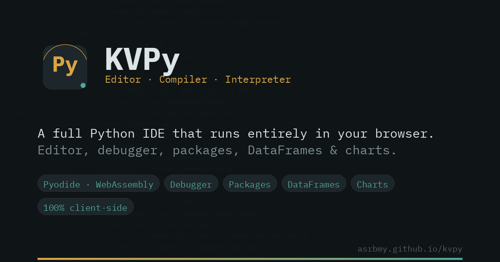

# KVPy

A full Python **editor, compiler, and interpreter** that runs entirely in your browser — no server, no installs, no account. Powered by [Pyodide](https://pyodide.org) (CPython compiled to WebAssembly) and [CodeMirror 6](https://codemirror.net/).

**Live site:** https://asrbmy.github.io/kvpy/
**Made by:** [ASRBMY](https://github.com/asrbmy)



---

## Features

**Editor**
Syntax highlighting, auto-indent, bracket/quote matching, line numbers, code folding, multi-cursor editing, find & replace, undo/redo, dark/light themes, adjustable font size, word wrap, an optional minimap, and configurable tab size.

**Run, debug, and inspect**
- Run / Stop / Debug, with a Terminal (stdout/stderr), Problems (tracebacks & lint), Output (DataFrames/charts/previews), and Variables panel
- A trace-replay debugger: breakpoints, Step Into/Over/Out, Continue, live variables and call stack
- `input()` support via a pre-fill dialog (browser Python can't truly pause mid-script, so this collects the values up front)
- Execution time and exit status on every run

**Coding quality**
- Real autocomplete via [Jedi](https://github.com/davidhalter/jedi), layered on top of built-in `str.`-method and `import`-name suggestions
- Background linting via [pyflakes](https://github.com/PyCQA/pyflakes)
- Format on demand or on save via `autopep8` or `black`
- A command palette (`Ctrl+Shift+P`) for fuzzy-searching every action

**Files & projects**
- A file explorer (new/rename/duplicate/delete/download/upload, folders), synced into Pyodide's in-browser filesystem so `import utils` and `open("data/file.csv")` just work
- Import/export `.py`, `.txt`, `.csv`, `.json`, `.zip`, and `.ipynb`
- A package manager for the scientific-Python stack (numpy, pandas, matplotlib, scipy, scikit-learn, …), via Pyodide + micropip
- Save Project to browser storage, autosave, and a "Welcome back" restore prompt

**Notebook mode**
Opening or creating a `.ipynb` file gives you real multi-cell editing — code and markdown cells, a shared persistent Python namespace across cells (so cell 2 can use cell 1's variables), per-cell output, execution counters, Run All / Restart & Run All, and standard nbformat save/export.

**Data & reporting**
- DataFrames render as sortable, filterable tables automatically
- matplotlib figures capture as inline images
- CSV/JSON file preview
- Export a report as a self-contained HTML page with a built-in "Print / Save as PDF" button

**Everything else**
A VS Code–style menu bar (File/Edit/View/Run/Terminal/Help), a proper Settings page, offline support via a service worker (once you've loaded it online, it keeps working with no network), and SEO/social metadata + a PWA manifest for installing it like an app.

---

## Getting started

KVPy is a static site — there's no build step and no backend.

```bash
git clone https://github.com/asrbmy/kvpy.git
cd kvpy
python3 -m http.server 8000
# then open http://localhost:8000
```

Any static file server works (`npx serve`, `php -S localhost:8000`, GitHub Pages, Netlify, etc.). You can also just double-click `index.html` to open it directly — most features work that way, **except** the service worker (offline support), which browsers only allow over `https://` or `http://localhost`.

First load fetches Pyodide's runtime from `cdn.jsdelivr.net` (roughly 10–20MB), so it can take a few seconds depending on your connection. After that first load, the service worker (when hosted) caches everything so it keeps working offline.

---

## Project structure

```
kvpy/
├── index.html          # the entire app — editor, runtime, UI, all in one file
├── kvsql-ui-kit.css     # the shared design-system stylesheet
├── sw.js                # service worker (offline caching)
├── site.webmanifest     # PWA manifest
├── favicon.svg          # vector favicon (modern browsers)
├── favicon.ico          # legacy favicon fallback
├── icon-180.png         # apple-touch-icon
├── icon-192.png         # Android/PWA icon
├── icon-512.png         # PWA icon (large)
├── og-banner.png        # 1200×630 social preview image
├── README.md
└── CHANGELOG.md
```

## How it works

- **Editor:** [CodeMirror 6](https://codemirror.net/), loaded as pinned-version ES modules from `esm.sh`.
- **Python runtime:** [Pyodide](https://pyodide.org) running inside a dedicated **Web Worker**, so a long-running or infinite loop can be interrupted (Stop) without freezing the page. The worker also handles autocomplete, linting, formatting, and per-cell notebook execution as background requests.
- **Filesystem:** an in-memory virtual file tree in the main thread is synced into Pyodide's own virtual FS (`pyodide.FS`) before every run, so multi-file imports and relative file reads work.
- **Persistence:** `localStorage` for save/autosave, `caches`/Service Worker for offline assets. Nothing is ever sent to a server — see the Security notes below.
- **Design system:** built on the `kvsql-ui-kit.css` component kit (dark-first, with a hand-built light theme).

## Browser support

Best in a recent Chrome, Edge, or Firefox (desktop or mobile). Requires `SharedArrayBuffer`-free WebAssembly (standard), Web Workers, and — for offline support specifically — a page served over HTTPS or `localhost`.

## Known limitations

- **Debugger is trace-replay, not live-pause.** Your script runs once with `sys.settrace` recording every line (capped at 4,000 steps), then Step/Continue navigate that recording. This avoids needing special server headers, but it means the debugger can't step through a truly infinite loop past the cap.
- **`input()` is pre-filled, not interactive mid-run**, for the same reason — browsers can't pause a running script to wait for a keypress without cross-origin-isolation headers this static site doesn't set.
- **Packages need a Pyodide/WASM build.** Pure-Python packages and the common scientific stack install fine via micropip; packages with native networking or unported C-extensions won't work in the browser.
- **Notebook cell themes are set at creation time** — cells made before a dark/light toggle keep their original colors until the notebook is reopened.
- CSV preview parsing is a simple comma-split (no quoted-field handling yet).

## Security

KVPy runs 100% client-side — no code you write is ever transmitted anywhere. Execution is isolated in a Web Worker with its own Pyodide heap, which is discarded on Stop/Restart. Rich HTML output (e.g. DataFrame previews) is sanitized before insertion, file/folder names are HTML-escaped, and all third-party CDN assets are version-pinned (with a Subresource Integrity hash where the platform supports it). See **Settings → Security** in the app for the full note, including what you'd need if you ever move Python execution to a server instead (containers, timeouts, resource limits, non-root, etc. — none of which apply to this browser-only build).

## Contributing

Issues and pull requests are welcome at the [GitHub repo](https://github.com/asrbmy/kvpy). Since it's a single static `index.html`, most changes are just editing that file directly — see `CHANGELOG.md` for how the project has evolved so far.

## License

MIT — see `LICENSE` (or treat this as MIT-licensed until one is added; update this section with your preferred license).

## Credits

**KVPy** — made by [ASRBMY](https://github.com/asrbmy) · [GitHub repo](https://github.com/asrbmy/kvpy) · [live site](https://asrbmy.github.io/kvpy/)
Built on Pyodide, CodeMirror 6, and the `kvsql-ui-kit` design system.
